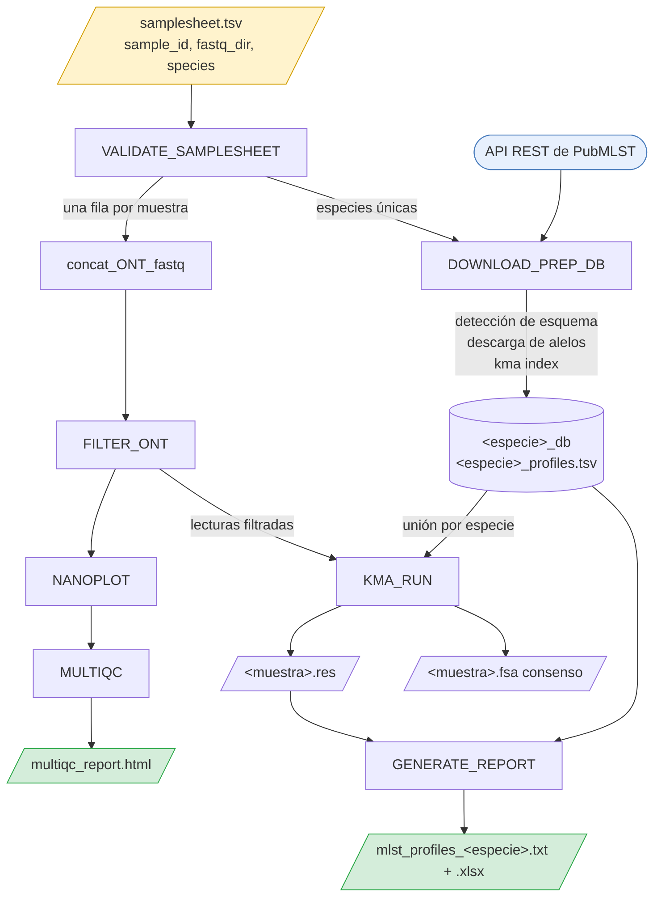

# NAKAST — Manual de usuario

Versión 1.0 · Referencia completa para ejecutar e interpretar NAKAST.

Para una primera corrida en cinco minutos, vea el [README](../README.md). Este manual asume
que el pipeline ya está instalado y cubre lo que el README no: cómo leer los resultados, qué
asume el pipeline sobre sus datos, y dónde están sus límites.

*An English version of this manual is available at [`USER_MANUAL.md`](USER_MANUAL.md).*

## Contenidos

**Primeros pasos**

[1. Qué hace NAKAST](#1-qué-hace-nakast)\
[2. Conceptos previos](#2-conceptos-previos)\
[3. Un ejemplo completo](#3-un-ejemplo-completo)

**Uso del pipeline**

[4. Especificación de entrada](#4-especificación-de-entrada)\
[5. Referencia de parámetros](#5-referencia-de-parámetros)\
[6. Referencia de salidas](#6-referencia-de-salidas)\
[7. Cómo interpretar los resultados](#7-cómo-interpretar-los-resultados)\
[8. Evaluación de la calidad de los datos](#8-evaluación-de-la-calidad-de-los-datos)

**Referencia**

[9. Arquitectura del flujo](#9-arquitectura-del-flujo)\
[10. Cómo se llaman los alelos](#10-cómo-se-llaman-los-alelos)\
[11. Asignación de ST y CC](#11-asignación-de-st-y-cc)\
[12. Especies soportadas](#12-especies-soportadas)\
[13. Supuestos](#13-supuestos)\
[14. Limitaciones](#14-limitaciones)\
[15. Resolución de problemas](#15-resolución-de-problemas)\
[16. Reproducibilidad](#16-reproducibilidad)\
[17. Notas de diseño](#17-notas-de-diseño)\
[18. Soporte, citación y licencia](#18-soporte-citación-y-licencia)

---

## 1. Qué hace NAKAST

NAKAST determina perfiles MLST a partir de lecturas de amplicones Oxford Nanopore. Usted
entrega directorios de FASTQ y un nombre de especie; el pipeline devuelve una tabla de
Sequence Types.



La especie actúa como **clave de agrupación**: la base de datos se descarga una vez por
especie distinta, cada muestra se une a la base de su propia especie, y se emite un reporte
por especie. Una misma corrida puede, por lo tanto, mezclar especies.

## 2. Conceptos previos

**MLST (Multi Locus Sequence Typing)** caracteriza un aislado bacteriano secuenciando un
conjunto pequeño de fragmentos de genes housekeeping, habitualmente siete. Cada secuencia
distinta en un locus recibe un **número de alelo** entero, curado centralizadamente.

**Perfil alélico** es el conjunto ordenado de números de alelo, por ejemplo `9-1-4-1-3-3-2`.

**Sequence Type (ST)** es un entero asignado a cada perfil alélico distinto. Un perfil
coincide con un ST solo si *todos* los alelos son coincidencia exacta con un alelo conocido.
Un solo locus sin caracterizar deja el aislado sin tipificar.

**Complejo Clonal (CC)** agrupa STs emparentados que comparten la mayoría de sus alelos. No
todos los esquemas definen complejos clonales: 102 de los 135 esquemas soportados lo hacen.
El resto reporta `CC = -`, lo cual es correcto y no una falla.

**PubMLST** (<https://pubmlst.org>) aloja las secuencias de alelos de referencia y las tablas
de perfiles. NAKAST consulta su API REST directamente, de modo que los resultados reflejan el
estado actual de la base de datos.

**KMA** es el alineador. Mapea lecturas contra una base de datos de secuencias de alelos
indexada por k-meros y reporta identidad, cobertura y profundidad por molde. Se adecúa a
datos redundantes de amplicones porque resuelve cuál de muchos alelos casi idénticos explica
mejor las lecturas.

## 3. Un ejemplo completo

Una corrida de tres aislados de *Streptococcus agalactiae*, desde los datos crudos hasta la
interpretación.

### Paso 1 — revisar los datos de entrada

Sus lecturas ya basecalled y demultiplexadas, un directorio por muestra:

```bash
ls ~/corrida_2026_03/fastq_pass/
# barcode01  barcode02  barcode03
ls ~/corrida_2026_03/fastq_pass/barcode01/ | head -3
# FBD86797_pass_barcode01_0.fastq.gz
```

### Paso 2 — encontrar el nombre de la especie

```bash
nextflow run nakast.nf --list_species | grep -i agalactiae
# sagalactiae    1    7  yes  Streptococcus agalactiae
```

### Paso 3 — escribir el samplesheet

Tres columnas separadas por tabulación:

```bash
printf 'sample_id\tfastq_dir\tspecies\n' > samplesheet.tsv
printf 'SGB11\t%s/barcode01\tsagalactiae\n' ~/corrida_2026_03/fastq_pass >> samplesheet.tsv
printf 'SGB12\t%s/barcode02\tsagalactiae\n' ~/corrida_2026_03/fastq_pass >> samplesheet.tsv
printf 'SGB13\t%s/barcode03\tsagalactiae\n' ~/corrida_2026_03/fastq_pass >> samplesheet.tsv
```

Use rutas absolutas. Las rutas relativas se resuelven contra el directorio desde el que se
lanza la corrida.

### Paso 4 — ejecutar

```bash
nextflow run /ruta/a/nakast/nakast.nf \
    --samplesheet samplesheet.tsv \
    --outdir resultados_corrida2026_03
```

Espere entre 5 y 10 minutos para tres muestras en un notebook, la mayor parte en KMA. La
primera corrida suma unos minutos extra para construir los ambientes Conda; las siguientes
los reutilizan.

### Paso 5 — leer el reporte

```
Sample  ST  CC     adhP  pheS  atr  glnA  sdhA  glcK  tkt  Profile
SGB11   10  cc12   9     1     4    1     3     3     2    OK
SGB12   24  cc452  5     4     4    3     2     3     3    OK
SGB13   2   cc1    1     1     3    1     1     2     2    OK
```

Tres aislados tipificados: ST10, ST24 y ST2. La sección 7 explica qué hacer cuando una fila
no se parece a estas.

### Paso 6 — revisar el control de calidad

Abra `resultados_corrida2026_03/qc/multiqc_report.html` para confirmar que los conteos de
lecturas y las distribuciones de calidad son los esperados para la corrida.

## 4. Especificación de entrada

Un archivo separado por tabulaciones, con fila de encabezado y tres columnas.

| Columna | Requerida | Descripción |
|---|---|---|
| `sample_id` | sí | Identificador único. Se usa como prefijo de los archivos de salida |
| `fastq_dir` | sí | Directorio con archivos `.fastq.gz` o `.fastq` |
| `species` | sí | Nombre corto del catálogo, por ejemplo `sagalactiae` |

Las columnas adicionales se ignoran, de modo que los samplesheets escritos para versiones
anteriores siguen funcionando.

La validación corre antes de cualquier trabajo pesado y verifica que existan las tres
columnas, que `sample_id` no esté vacío y sea único, que los directorios referenciados
existan en disco, y que `species` figure en `assets/pubmlst_species.tsv`. Una especie mal
escrita falla en segundos con una sugerencia, en vez de hacerlo tras una descarga parcial.

Un lote de especies mezcladas se escribe exactamente igual:

```
sample_id	fastq_dir	species
SGB11	/datos/corrida1/barcode01	sagalactiae
SAL07	/datos/corrida1/barcode02	salmonella
```

## 5. Referencia de parámetros

### Entrada y salida

| Parámetro | Por defecto | Descripción |
|---|---|---|
| `--samplesheet` | `samplesheet.tsv` | Tabla de entrada |
| `--outdir` | `results` | Directorio base de salida |
| `--qc_outdir` | `<outdir>/qc` | Salidas de control de calidad |
| `--consensus_outdir` | `<outdir>/consensus_sequences` | FASTA consenso |
| `--report_outdir` | `<outdir>/reports` | Archivos `.res` y tablas de perfiles |
| `--mlst_report` | `mlst_profiles` | Nombre base del reporte final |

### Filtrado de lecturas

| Parámetro | Por defecto | Descripción |
|---|---|---|
| `--nano_base_quality` | `20` | Calidad Phred mínima, entregada a chopper |
| `--min_length` | `300` | Longitud mínima de lectura (filtlong) |
| `--keep_percent` | `80` | Conservar este porcentaje de las mejores lecturas por bases (filtlong) |

### Llamado de alelos

| Parámetro | Por defecto | Descripción |
|---|---|---|
| `--min_depth` | `30` | Profundidad mínima, aplicada en KMA y de nuevo en el script de reporte |
| `--min_identity` | `90` | Identidad mínima respecto del alelo de referencia (%) |
| `--allele_coverage` | `90` | Cobertura mínima del alelo, es decir del molde (%) |
| `--kma_k` | `31` | Tamaño de k-mero para el índice de KMA |
| `--generate_consensus` | `true` | Publicar las secuencias consenso por locus |

### Modos de ejecución

| Parámetro | Por defecto | Descripción |
|---|---|---|
| `--qc_only` | `false` | Solo control de calidad; sin descarga ni tipificación |
| `--list_species` | `false` | Imprimir el catálogo de especies soportadas y salir |
| `--help` | `false` | Imprimir la ayuda y salir |

### Opciones de Nextflow que conviene conocer

Pertenecen a Nextflow y llevan un solo guion.

| Opción | Propósito |
|---|---|
| `-resume` | Reutilizar el trabajo completado en la corrida anterior |
| `-profile host` | Usar las herramientas del `PATH` en vez de Conda |
| `-with-report` | Reporte HTML de ejecución adicional |

### Recursos

Se asignan por etiqueta en `nextflow.config`. Edite ese archivo según su máquina.

| Etiqueta | CPUs | Memoria | Tiempo | Procesos |
|---|---:|---:|---:|---|
| `process_low` | 2 | 4 GB | 2 h | validación, base de datos, listado de especies |
| `process_medium` | 6 | 10 GB | 8 h | concatenación, filtrado, QC, reporte |
| `process_high` | 12 | 16 GB | 24 h | alineamiento con KMA |

## 6. Referencia de salidas

```
results/
├── mlst_profiles_<especie>.txt      ← el resultado
├── mlst_profiles_<especie>.xlsx
├── qc/
│   ├── qc_<muestra>/
│   └── multiqc_report.html          ← calidad de la corrida
├── consensus_sequences/
│   └── <muestra>.fsa
├── reports/
│   ├── <muestra>.res                ← evidencia por alelo
│   └── <especie>_profiles.tsv
└── pipeline_info/
```

### Qué archivo responde cada pregunta

| Pregunta | Archivo |
|---|---|
| ¿Qué ST tiene mi aislado? | `mlst_profiles_<especie>.txt` |
| ¿Por qué se llamó así este alelo? | `reports/<muestra>.res` |
| ¿Secuenció bien la corrida? | `qc/multiqc_report.html` |
| ¿Qué secuencia envío a PubMLST o confirmo por Sanger? | `consensus_sequences/<muestra>.fsa` |
| ¿Qué versión de PubMLST usó esta corrida? | `reports/<especie>_profiles.tsv` |
| ¿Cuánto demoró, qué falló? | `pipeline_info/` |

### Columnas del reporte final

| Columna | Contenido |
|---|---|
| `Sample` | Identificador de la muestra |
| `ST` | Sequence Type, o `-` si el perfil no coincide con ninguno |
| `CC` | Complejo Clonal, o `-` si no está asignado o el esquema no lo define |
| una columna por locus | Llamado del alelo con su anotación de calidad |
| `Profile` | `OK`, o `INCOMPLETE (n/N)` cuando se recuperaron menos de N loci |

### Archivos intermedios

- `reports/<muestra>.res` — salida cruda de KMA. El registro autoritativo de identidad,
  cobertura, profundidad y puntaje para cada molde considerado.
- `reports/<especie>_profiles.tsv` — la tabla de perfiles de PubMLST exacta que se usó.
  Consérvela: PubMLST cambia con el tiempo y este archivo permite reproducir la corrida
  después.
- `consensus_sequences/<muestra>.fsa` — consenso de KMA por locus.
- `pipeline_info/` — reporte de ejecución, línea de tiempo y traza.

## 7. Cómo interpretar los resultados

Recorra esto en orden cuando una fila no sea un `OK` limpio con su ST.

### Las anotaciones de alelo

| Notación | Significado |
|---|---|
| `9` | Coincidencia exacta con el alelo 9 |
| `~9` | El más cercano es el alelo 9, pero la secuencia difiere |
| `9?` | Coincide con el alelo 9, pero la lectura es más larga que la referencia |
| `INS` | La lectura cubre menos que el alelo completo |
| `-` | Sin llamado: bajo los umbrales de identidad, cobertura o profundidad |

**Solo los enteros sin anotación pueden coincidir con un perfil de PubMLST.** Es el dato más
útil de este manual. Si cualquier locus lleva `~`, `?`, `INS` o `-`, el perfil no puede
coincidir y `ST` será `-`. La búsqueda del ST no falló; el perfil simplemente estaba
incompleto.

### Guía de decisión

**`ST = -` pero todos los loci tienen un entero sin anotación.** El perfil está completo pero
esa combinación no existe en PubMLST. Es un ST genuinamente nuevo. Considere depositarlo.

**`ST = -` y un locus muestra `~N`.** El caso más frecuente. Ese locus difiere de todos los
alelos conocidos. O es un alelo nuevo, o el consenso arrastra un error de secuenciación. Para
distinguirlos, revise la profundidad de ese locus en el archivo `.res`. Una diferencia
consistente a alta profundidad apunta a un alelo nuevo real; confírmelo por Sanger usando el
consenso de `consensus_sequences/`. Una diferencia a baja profundidad es más probablemente un
artefacto.

**`ST = -` y un locus muestra `-`.** Ese locus no se recuperó. Revise su profundidad en el
archivo `.res`. Una profundidad bajo `--min_depth` significa que el amplicón rindió mal, lo
cual es un problema de laboratorio y no de análisis. Reamplifique o secuencie más profundo.

**`Profile = INCOMPLETE (6/7)`.** Se recuperaron seis de siete loci. El diagnóstico es el
mismo: identifique el locus faltante y revise su profundidad.

**`ST` asignado pero `CC = -`.** Habitualmente es correcto. Muchos STs no tienen complejo
clonal, y 33 de los 135 esquemas no definen ninguno. Revise la columna `CC` del catálogo para
su especie.

**Todas las muestras con `ST = -`.** Sospeche del valor de `species` antes que de los datos.
Tipificar contra el esquema equivocado produce resultados vacíos sin ningún error.

### Cómo leer el archivo de evidencia

```bash
column -t results/reports/SGB20.res | head
```

Las columnas que importan son `#Template` (locus y alelo), `Template_Identity`,
`Template_Coverage`, `Query_Coverage` y `Depth`. Un alelo llamado `~9` mostrará
`Template_Identity` bajo 100. Un locus reportado como `-` puede estar ausente del archivo por
completo, lo que significa que nada pasó los umbrales.

## 8. Evaluación de la calidad de los datos

NAKAST no impone un umbral de calidad más allá de `--min_depth`. Use estos puntos de
referencia, obtenidos en la validación con el panel de amplicones propio para
*S. agalactiae*.

| Métrica | Habitual | Preocupante |
|---|---|---|
| Profundidad por locus | de varios cientos a algunos miles | bajo 100 |
| Loci recuperados | 7 de 7 | 6 o menos |
| Alelos anotados por muestra | 0 | 2 o más |
| Calidad mediana de lectura | alrededor de Q18 | bajo Q12 |

La profundidad varía bastante entre loci en un panel de amplicones: una diferencia de diez
veces entre el mejor y el peor amplicón es normal. Lo que importa es que el locus más débil
supere `--min_depth`.

Una profundidad muy alta no rescata una amplificación deficiente. Si un locus es
consistentemente débil en todas las muestras de una corrida, la causa está en el partidor o
en la reacción, no en el análisis.

## 9. Arquitectura del flujo

| Proceso | Herramienta | Propósito |
|---|---|---|
| `VALIDATE_SAMPLESHEET` | python, pandas | Verificación previa del samplesheet |
| `DOWNLOAD_PREP_DB` | python, kma | Detectar esquema, descargar alelos y perfiles, indexar |
| `concat_ONT_fastq` | coreutils, gzip | Unir un directorio de barcode en un solo FASTQ |
| `FILTER_ONT` | filtlong, chopper | Filtrado por longitud y calidad |
| `NANOPLOT` | NanoPlot | Control de calidad por muestra |
| `MULTIQC` | MultiQC | Reporte de calidad agregado |
| `KMA_RUN` | kma | Alinear lecturas contra la base de alelos |
| `GENERATE_REPORT` | python, pandas, openpyxl | Llamado de alelos, asignación de ST y CC, reportes |
| `LIST_SPECIES` | python | Imprimir el catálogo de especies soportadas |

**El comportamiento ante fallas** difiere por etapa, de forma deliberada:

| Proceso | Estrategia | Razón |
|---|---|---|
| `VALIDATE_SAMPLESHEET` | `terminate` | Un samplesheet inválido debe detener todo de inmediato |
| `DOWNLOAD_PREP_DB` | 3 reintentos, luego `finish` | Sobrevive cortes de red transitorios; deja terminar el QC para que `-resume` pueda continuar |
| `KMA_RUN`, `GENERATE_REPORT` | `terminate` | Una falla silenciosa aquí produciría una corrida sin resultados y exit 0 |
| `concat_ONT_fastq`, `FILTER_ONT`, `NANOPLOT`, `MULTIQC` | `ignore` | Una muestra mala no debe abortar el lote |

## 10. Cómo se llaman los alelos

### Paso 1 — filtro de profundidad

Los moldes bajo `--min_depth` se descartan, tanto en KMA como nuevamente en el script de
reporte.

### Paso 2 — elegir un ganador por locus

Varios alelos del mismo locus suelen atraer lecturas, ya que difieren en unas pocas bases.
NAKAST los ordena con un puntaje de confianza:

```
Score_Ratio = Score / Expected
Confidence  = Score_Ratio × log1p(Depth) × bonus_perfecto
```

`bonus_perfecto` vale 1.5 cuando identidad, cobertura del molde y cobertura de la consulta
son todas 100%, y 1.0 en caso contrario. El molde con mayor confianza gana el locus.

El bonus es multiplicativo y no absoluto a propósito: una coincidencia perfecta todavía
necesita profundidad que la respalde, de modo que una sola lectura bien alineada no puede
superar a un alelo con cobertura profunda.

### Paso 3 — anotar el llamado

| Notación | Condición |
|---|---|
| `9` | Identidad, cobertura del molde y de la consulta, todas 100% |
| `~9` | Cobertura de consulta y molde 100%, identidad bajo 100% |
| `9?` | Cobertura de consulta sobre 100%, identidad y cobertura sobre los umbrales |
| `INS` | Cobertura de consulta bajo 100% |
| `-` | Identidad o cobertura del molde bajo los umbrales, o ningún molde pasó |

Una nota sobre `?`: una cobertura de consulta sobre 100% significa que la lectura es *más
larga* que el molde. Con un panel de amplicones esto refleja read-through y no truncamiento,
así que el llamado suele ser correcto. Interprete `9?` como "probablemente el alelo 9, vale
la pena confirmarlo" y no como una falla.

## 11. Asignación de ST y CC

Los llamados de alelo se unen en una firma (`9/1/4/1/3/3/2`) que se compara contra la misma
firma construida a partir de la tabla de perfiles de PubMLST. La comparación es exacta y
sobre texto:

- Los loci provienen de `<especie>_loci.txt`, escrito desde la definición del esquema, y
  luego se ordenan como aparecen en la tabla de perfiles, de modo que el reporte conserva el
  orden canónico de PubMLST.
- La tabla de perfiles se lee como texto para que un valor faltante no convierta en silencio
  una columna de locus en números decimales y produzca `1.0/1/2/...`, lo que haría fallar
  todas las comparaciones.
- La columna de CC se detecta de forma tolerante (`clonal_complex`, `clonal complex`, `cc`,
  `clonalcomplex`). Si no existe, `CC = -`.
- Si no hay coincidencia se devuelve `ST = -`. **NAKAST nunca reporta un ST cercano o
  aproximado.**

## 12. Especies soportadas

`assets/pubmlst_species.tsv` y `docs/supported_species.md` catalogan los **135 esquemas de
PubMLST** que definen perfiles ST. Para regenerarlos:

```bash
python3 bin/list_pubmlst_species.py --write-catalogue .
```

Dos supuestos que se cumplen para *S. agalactiae* pero no en general, y que NAKAST por lo
tanto resuelve en tiempo de ejecución:

- **El esquema MLST no siempre es el número 1.** Siete esquemas usan otro identificador;
  *Salmonella* usa el 2. NAKAST selecciona el esquema cuya descripción comienza con `MLST`.
- **Los esquemas no siempre tienen siete loci.** Van de 2 a 10, y 48 de 135 difieren de
  siete. La lista de loci proviene de la definición del esquema, nunca de una lista fija.

Los nombres de locus también son menos regulares de lo que parecen: `MLST_adk`, `16S_rRNA` e
`int_hyp` contienen guiones bajos, por lo que los identificadores de alelo se separan por la
derecha.

## 13. Supuestos

Estos importan para interpretar los resultados.

1. **Secuenciación de amplicones, no genoma completo.** Se asume que las lecturas provienen
   de amplificación dirigida de los loci MLST. Se espera profundidad de cientos o miles, y
   los umbrales por defecto reflejan eso. Datos de genoma completo darán una profundidad por
   locus mucho menor y muchos llamados `-`.
2. **La especie se conoce y se declara.** NAKAST no identifica el organismo; tipifica la
   muestra contra el esquema que usted especifique. Una `species` equivocada produce un
   resultado vacío, no un error.
3. **PubMLST está accesible y es la fuente autoritativa.** La base se descarga fresca en cada
   corrida, de modo que los resultados dependen del estado de PubMLST en ese momento. Por eso
   la tabla de perfiles se publica junto con las salidas.
4. **El esquema define perfiles ST.** Los esquemas sin clave primaria, como cgMLST, quedan
   fuera del catálogo y se rechazan al momento de la descarga.
5. **Los identificadores de muestra son únicos** en todo el samplesheet. Dan nombre a los
   archivos de salida.
6. **Las lecturas están basecalled y demultiplexadas.** NAKAST parte de FASTQ por barcode. No
   hace basecalling, ni demultiplexado, ni recorte de adaptadores y barcodes.
7. **Un organismo por muestra.** Cultivos mixtos o contaminados producen alelos en
   competencia en algunos loci; el puntaje de confianza elegirá uno, y una anotación `~` suele
   ser la única señal visible.

## 14. Limitaciones

1. **Solo Oxford Nanopore.** No hay ruta para lecturas cortas. Los parámetros de filtrado y
   alineamiento están afinados para el perfil de error de ONT, y el samplesheet recibe un
   directorio de archivos FASTQ y no pares de lecturas.
2. **No detecta ni deposita alelos nuevos.** Una secuencia ausente de PubMLST se reporta como
   `~N` contra el alelo conocido más cercano. NAKAST no la marcará como nueva, no propondrá un
   número ni preparará un depósito. La confirmación, por Sanger por ejemplo, es un paso
   manual; el consenso en `consensus_sequences/` es el punto de partida.
3. **Requiere red.** No hay modo sin conexión ni caché local entre corridas. Cada corrida
   vuelve a descargar el esquema.
4. **Validado biológicamente en una sola especie.** La arquitectura es agnóstica de especie y
   se ejercitó contra los esquemas de *Salmonella*, *Brucella*, *Vibrio* y *Mycoplasma
   genitalium*, pero la validación contra aislados conocidos se hizo solo para
   *S. agalactiae* con el panel de amplicones propio. Los parámetros de alineamiento
   están afinados para ese panel.
5. **Los complejos clonales dependen del esquema.** 33 de 135 esquemas no definen ninguno, y
   aun donde existen, muchos STs no tienen CC.
6. **No detecta contaminación ni muestras mixtas.** No hay una verificación explícita de
   alelos múltiples en un mismo locus.
7. **Los umbrales de profundidad son globales.** `--min_depth` se aplica por igual a todos los
   loci. Un panel donde un amplicón rinde sistemáticamente mal puede requerir bajar el umbral
   para toda la corrida.
8. **Un reporte por especie.** Los lotes que abarcan varias especies producen varios archivos
   en vez de una tabla única, porque las columnas de loci difieren.

## 15. Resolución de problemas

**`Unknown configuration profile: 'conda'`** — Conda está habilitado por defecto; quite el
flag `-profile conda`.

**`command not found` / exit status 127** — el proceso corrió contra el `PATH` del sistema en
vez de su ambiente Conda. Confirme que `nextflow config .` reporte `conda { enabled = true }`
y que ningún `nextflow.config` suelto en su directorio de lanzamiento lo esté sobrescribiendo.

**`Variable declarations cannot be mixed with config statements`** — un `nextflow.config` en
su directorio de lanzamiento usa sintaxis que Nextflow 26 rechaza. Nextflow fusiona el config
del directorio de lanzamiento con el del pipeline, así que un config ajeno de un proyecto
viejo romperá la corrida. Lance desde un directorio limpio.

**Todos los ST son `-`** — revise primero el valor de `species`, después las columnas de
alelo. Vea la [sección 7](#7-cómo-interpretar-los-resultados).

**La validación rechaza la especie** — ejecute `--list_species` y use el nombre corto exacto.
El mensaje de error sugiere coincidencias cercanas.

**Falla la descarga** — el pipeline reintenta tres veces antes de detenerse, y deja terminar
el QC en curso. Vuelva a correr con `-resume` cuando se restablezca la conexión; el trabajo
completado se reutiliza.

**No se cachea nada con `-resume`** — verifique que nada en las entradas de las tareas cambie
entre corridas. Interpolar un objeto `Path` como `launchDir` directamente en el script de un
proceso le da un hash inestable; páselo como entrada `val`.

**Falta una muestra en el reporte** — su paso de filtrado o de QC falló y se ignoró para que
el lote continuara. Busque `Error is ignored` en el log de Nextflow y revise
`pipeline_info/` para ver qué proceso falló.

## 16. Reproducibilidad

Cada proceso declara su propio ambiente Conda con versiones exactas:

| Proceso | Ambiente |
|---|---|
| `VALIDATE_SAMPLESHEET` | `python=3.13.11 pandas=2.3.3` |
| `DOWNLOAD_PREP_DB`, `KMA_RUN` | `python=3.13.11 kma=1.6.8` |
| `concat_ONT_fastq` | `python=3.13.11 coreutils=9.5 gzip=1.12` |
| `FILTER_ONT` | `python=3.13.11 filtlong=0.3.1 chopper=0.12.0 gzip=1.12` |
| `NANOPLOT` | `python=3.13.11 nanoplot=1.46.2` |
| `MULTIQC` | `python=3.13.11 multiqc=1.33` |
| `GENERATE_REPORT` | `python=3.13.11 pandas=2.3.3 numpy=2.4.0 openpyxl=3.1.5` |
| `LIST_SPECIES` | `python=3.13.11` |

Los ambientes se cachean en `$HOME/.nextflow/conda` y se construyen con mamba. Las
especificaciones idénticas comparten un mismo ambiente.

La única entrada que *no* está fijada es PubMLST, que cambia a medida que los curadores
agregan alelos y STs. Para reproducir una corrida pasada, conserve
`reports/<especie>_profiles.tsv` y la traza de `pipeline_info/` junto al reporte.

## 17. Notas de diseño

Se registran aquí dos hallazgos del ajuste contra datos reales de *S. agalactiae*, porque son
contraintuitivos y fáciles de reintroducir. Esta sección apunta a quien mantenga el código,
no a quien lo use.

**El `-mrc` de KMA no es cobertura del alelo.** `-mrc` es *minimum query coverage*: la
fracción de la **lectura** que debe alinear. Una versión anterior le pasaba
`--allele_coverage`. Con lecturas de alrededor de 950 pb contra amplicones de 500 pb, la
mayoría de las lecturas no puede alcanzar 90% de cobertura de consulta. Los loci con lecturas
abundantes sobrevivían igual, pero los loci poco amplificados perdían todas sus lecturas y
desaparecían pese a ser coincidencias perfectas al 100% de identidad y cobertura. El flag se
eliminó; la cobertura del alelo se controla aguas abajo sobre `Template_Coverage`, que es
donde corresponde.

**Los umbrales de calidad de filtlong no están en escala Phred.** `--min_mean_q` y
`--min_window_q` toman un porcentaje de exactitud de 0 a 100, así que pasarles `20` no filtra
absolutamente nada (Q20 corresponde a 99). Fijarlos en un valor que sí filtre resultó
perjudicial: en 95 los loci poco amplificados perdieron todo su soporte, porque los loci de
baja abundancia también tienden a llevar las lecturas de peor calidad. Los flags se
eliminaron y la calidad se controla únicamente con chopper, en escala Phred, mediante
`--nano_base_quality`.

Un resultado negativo relacionado: escalonar umbrales de calidad (Q30 → Q25 → Q20) no es
viable con datos típicos de amplicones ONT. Con una calidad mediana por lectura cercana a
Q18, los umbrales sobre Q22 aproximadamente retienen una fracción de un por ciento de las
bases, y los fragmentos sobrevivientes son más cortos que un amplicón, por lo que no pueden
cubrir un alelo.

## 18. Soporte, citación y licencia

**Reportar problemas.** Abra un issue en
<https://github.com/javiertognarelli/nakast/issues>. Incluya la versión de Nextflow
(`nextflow -version`), el comando que ejecutó, y la parte relevante de `.nextflow.log`.

**Autoría.**

NAKAST — Javier Tognarelli Santiago, Genómica UV, Escuela de Medicina,
Universidad de Valparaíso, Chile\
Daniel Escobar Araya, Unidad de Investigación e Innovación, Instituto de Salud Pública, Chile\
Fernando Amaya Inzunza, Unidad de Investigación e Innovación, Instituto de Salud Pública,
Chile

**Citar NAKAST.** Cite este pipeline junto con PubMLST y las herramientas subyacentes. La
lista completa de componentes de terceros y sus licencias está en
[`THIRD_PARTY_LICENSES.md`](THIRD_PARTY_LICENSES.md).

**Fuente de datos.** Las definiciones de alelos y perfiles provienen de PubMLST
(<https://pubmlst.org>), alojado en la Universidad de Oxford. Reconozca a PubMLST y al
esquema correspondiente en cualquier publicación que use estos resultados.
