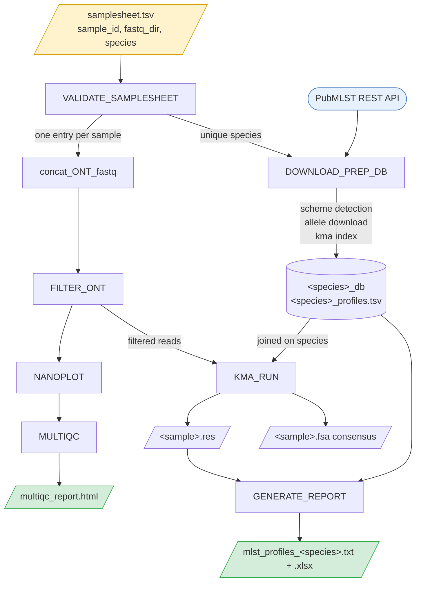

# NAKAST — User Manual

Version 1.0 · Complete reference for running and interpreting NAKAST.

For a five-minute first run, see the [README](../README.md). This manual assumes you have
already installed the pipeline and covers what the README does not: how to read your
results, what the pipeline assumes about your data, and where its limits are.

## Contents

**Getting started**

[1. What NAKAST does](#1-what-nakast-does)\
[2. Background concepts](#2-background-concepts)\
[3. A complete worked example](#3-a-complete-worked-example)

**Using the pipeline**

[4. Input specification](#4-input-specification)\
[5. Parameter reference](#5-parameter-reference)\
[6. Output reference](#6-output-reference)\
[7. Interpreting your results](#7-interpreting-your-results)\
[8. Assessing data quality](#8-assessing-data-quality)

**Reference**

[9. Workflow architecture](#9-workflow-architecture)\
[10. How allele calling works](#10-how-allele-calling-works)\
[11. ST and CC assignment](#11-st-and-cc-assignment)\
[12. Species support](#12-species-support)\
[13. Assumptions](#13-assumptions)\
[14. Limitations](#14-limitations)\
[15. Troubleshooting](#15-troubleshooting)\
[16. Reproducibility](#16-reproducibility)\
[17. Design notes](#17-design-notes)\
[18. Support, citation and licence](#18-support-citation-and-licence)

---

## 1. What NAKAST does

NAKAST determines MLST profiles from Oxford Nanopore amplicon reads. You supply FASTQ
directories and a species name; it returns a table of Sequence Types.



The species acts as a **grouping key**: the database is downloaded once per distinct species,
each sample is matched to the database of its own species, and one report is produced per
species. A single run may therefore mix species.

## 2. Background concepts

**MLST (Multi Locus Sequence Typing)** characterises a bacterial isolate by sequencing a
small set of housekeeping gene fragments, usually seven. Each distinct sequence at a locus
receives an integer **allele number**, curated centrally.

**Allelic profile** is the ordered set of allele numbers, for example `9-1-4-1-3-3-2`.

**Sequence Type (ST)** is an integer assigned to each distinct allelic profile. A profile
matches an ST only if *every* allele is an exact match to a known allele. One uncharacterised
locus leaves the isolate untyped.

**Clonal Complex (CC)** groups related STs that share most of their alleles. Not every scheme
defines clonal complexes: 102 of the 135 supported schemes do. The rest report `CC = -`,
which is correct rather than a failure.

**PubMLST** (<https://pubmlst.org>) hosts the reference allele sequences and profile tables.
NAKAST queries its REST API directly, so results reflect the current state of the database.

**KMA** is the aligner. It maps reads against a k-mer indexed database of allele sequences
and reports identity, coverage and depth per template. It suits redundant amplicon data
because it resolves which of many near-identical alleles best explains the reads.

## 3. A complete worked example

A run of three *Streptococcus agalactiae* isolates, from raw data to interpretation.

### Step 1 — check your input data

Your basecalled, demultiplexed reads, one directory per sample:

```bash
ls ~/run_2026_03/fastq_pass/
# barcode01  barcode02  barcode03
ls ~/run_2026_03/fastq_pass/barcode01/ | head -3
# FBD86797_pass_barcode01_0.fastq.gz
```

### Step 2 — find the species name

```bash
nextflow run nakast.nf --list_species | grep -i agalactiae
# sagalactiae    1    7  yes  Streptococcus agalactiae
```

### Step 3 — write the samplesheet

Three tab-separated columns:

```bash
printf 'sample_id\tfastq_dir\tspecies\n' > samplesheet.tsv
printf 'SGB11\t%s/barcode01\tsagalactiae\n' ~/run_2026_03/fastq_pass >> samplesheet.tsv
printf 'SGB12\t%s/barcode02\tsagalactiae\n' ~/run_2026_03/fastq_pass >> samplesheet.tsv
printf 'SGB13\t%s/barcode03\tsagalactiae\n' ~/run_2026_03/fastq_pass >> samplesheet.tsv
```

Use absolute paths. Relative paths resolve against the directory you launch from.

### Step 4 — run

```bash
nextflow run /path/to/nakast/nakast.nf \
    --samplesheet samplesheet.tsv \
    --outdir results_run2026_03
```

Expect roughly 5–10 minutes for three samples on a laptop, most of it in KMA. The first run
adds a few minutes to build the Conda environments; later runs reuse them.

### Step 5 — read the report

```
Sample  ST  CC     adhP  pheS  atr  glnA  sdhA  glcK  tkt  Profile
SGB11   10  cc12   9     1     4    1     3     3     2    OK
SGB12   24  cc452  5     4     4    3     2     3     3    OK
SGB13   2   cc1    1     1     3    1     1     2     2    OK
```

Three isolates typed: ST10, ST24 and ST2. Section 7 explains what to do when a row does not
look like these.

### Step 6 — check the QC

Open `results_run2026_03/qc/multiqc_report.html` to confirm read counts and quality
distributions are as expected for the run.

## 4. Input specification

A tab-separated file with a header row and three columns.

| Column | Required | Description |
|---|---|---|
| `sample_id` | yes | Unique identifier. Becomes the output file prefix |
| `fastq_dir` | yes | Directory containing `.fastq.gz` or `.fastq` files |
| `species` | yes | Short name from the catalogue, for example `sagalactiae` |

Additional columns are ignored, so samplesheets written for earlier versions keep working.

Validation runs before any heavy work and checks that the three columns exist, that
`sample_id` is non-empty and unique, that the referenced directories exist on disk, and that
`species` appears in `assets/pubmlst_species.tsv`. A misspelled species fails in seconds
with a suggestion rather than after a partial download.

A mixed-species batch is written exactly the same way:

```
sample_id	fastq_dir	species
SGB11	/data/run1/barcode01	sagalactiae
SAL07	/data/run1/barcode02	salmonella
```

## 5. Parameter reference

### Input and output

| Parameter | Default | Description |
|---|---|---|
| `--samplesheet` | `samplesheet.tsv` | Input table |
| `--outdir` | `results` | Base output directory |
| `--qc_outdir` | `<outdir>/qc` | QC outputs |
| `--consensus_outdir` | `<outdir>/consensus_sequences` | Consensus FASTA |
| `--report_outdir` | `<outdir>/reports` | `.res` files and profile tables |
| `--mlst_report` | `mlst_profiles` | Base name of the final report |

### Read filtering

| Parameter | Default | Description |
|---|---|---|
| `--nano_base_quality` | `20` | Minimum Phred quality, passed to chopper |
| `--min_length` | `300` | Minimum read length (filtlong) |
| `--keep_percent` | `80` | Keep this percentage of the best reads by bases (filtlong) |

### Allele calling

| Parameter | Default | Description |
|---|---|---|
| `--min_depth` | `30` | Minimum depth, applied in KMA and again in the report script |
| `--min_identity` | `90` | Minimum identity to the reference allele (%) |
| `--allele_coverage` | `90` | Minimum allele (template) coverage (%) |
| `--kma_k` | `31` | K-mer size for the KMA index |
| `--generate_consensus` | `true` | Publish per-locus consensus sequences |

### Run modes

| Parameter | Default | Description |
|---|---|---|
| `--qc_only` | `false` | Run QC only; no download, no typing |
| `--list_species` | `false` | Print the supported-species catalogue and exit |
| `--help` | `false` | Print usage and exit |

### Nextflow options worth knowing

These belong to Nextflow itself and take a single dash.

| Option | Purpose |
|---|---|
| `-resume` | Reuse completed work from the previous run |
| `-profile host` | Use the tools on your `PATH` instead of Conda |
| `-with-report` | Extra HTML execution report |

### Resources

Assigned by label in `nextflow.config`. Edit that file to fit your machine.

| Label | CPUs | Memory | Time | Processes |
|---|---:|---:|---:|---|
| `process_low` | 2 | 4 GB | 2 h | validation, database, species listing |
| `process_medium` | 6 | 10 GB | 8 h | concatenation, filtering, QC, report |
| `process_high` | 12 | 16 GB | 24 h | KMA alignment |

## 6. Output reference

```
results/
├── mlst_profiles_<species>.txt      ← the answer
├── mlst_profiles_<species>.xlsx
├── qc/
│   ├── qc_<sample>/
│   └── multiqc_report.html          ← run quality
├── consensus_sequences/
│   └── <sample>.fsa
├── reports/
│   ├── <sample>.res                 ← evidence per allele
│   └── <species>_profiles.tsv
└── pipeline_info/
```

### Which file answers which question

| Question | File |
|---|---|
| What ST is my isolate? | `mlst_profiles_<species>.txt` |
| Why was this allele called? | `reports/<sample>.res` |
| Did the run sequence well? | `qc/multiqc_report.html` |
| What sequence do I submit to PubMLST or confirm by Sanger? | `consensus_sequences/<sample>.fsa` |
| Which PubMLST version did this run use? | `reports/<species>_profiles.tsv` |
| How long did it take, what failed? | `pipeline_info/` |

### Final report columns

| Column | Content |
|---|---|
| `Sample` | Sample identifier |
| `ST` | Sequence Type, or `-` if the profile matches nothing |
| `CC` | Clonal Complex, or `-` if unassigned or not defined by the scheme |
| one column per locus | Allele call with its quality annotation |
| `Profile` | `OK`, or `INCOMPLETE (n/N)` when fewer than N loci were recovered |

### Intermediate files

- `reports/<sample>.res` — raw KMA output. The authoritative record of identity, coverage,
  depth and score for every template considered.
- `reports/<species>_profiles.tsv` — the exact PubMLST profile table used. Keep it: PubMLST
  changes over time, and this file makes the run reproducible after the fact.
- `consensus_sequences/<sample>.fsa` — KMA consensus per locus.
- `pipeline_info/` — execution report, timeline and trace.

## 7. Interpreting your results

Work through this in order when a row is not a clean `OK` with an ST.

### The allele annotations

| Notation | Meaning |
|---|---|
| `9` | Exact match to allele 9 |
| `~9` | Closest to allele 9, but the sequence differs |
| `9?` | Matches allele 9, but the read is longer than the reference |
| `INS` | The read covers less than the full allele |
| `-` | No call: below identity, coverage or depth thresholds |

**Only bare integers can match a PubMLST profile.** This is the single most useful fact in
this manual. If any locus carries `~`, `?`, `INS` or `-`, the profile cannot match and `ST`
will be `-`. The ST lookup did not fail; the profile was simply incomplete.

### Decision guide

**`ST = -` but every locus has a bare integer.** The profile is complete but that combination
is not in PubMLST. This is a genuinely new ST. Consider submitting it.

**`ST = -` and one locus shows `~N`.** The most common case. That locus differs from every
known allele. Either it is a novel allele, or the consensus carries a sequencing error. To
tell them apart, check the depth of that locus in the `.res` file. A consistent difference at
high depth points to a real novel allele; confirm by Sanger using the consensus in
`consensus_sequences/`. A difference at low depth is more likely an artefact.

**`ST = -` and one locus shows `-`.** That locus was not recovered. Check its depth in the
`.res` file. Depth below `--min_depth` means the amplicon underperformed, which is a wet-lab
problem, not an analysis one. Re-amplify or sequence deeper.

**`Profile = INCOMPLETE (6/7)`.** Six of seven loci were recovered. Same diagnosis as above:
find the missing locus and check its depth.

**`ST` assigned but `CC = -`.** Usually correct. Many STs have no clonal complex, and 33 of
the 135 schemes define none at all. Check the `CC` column in the catalogue for your species.

**Every sample has `ST = -`.** Suspect the `species` value before suspecting the data. Typing
against the wrong scheme produces empty results without any error.

### Reading the evidence file

```bash
column -t results/reports/SGB20.res | head
```

The columns that matter are `#Template` (locus and allele), `Template_Identity`,
`Template_Coverage`, `Query_Coverage` and `Depth`. An allele called `~9` will show
`Template_Identity` below 100. A locus reported as `-` may be absent from the file entirely,
which means nothing passed the thresholds.

## 8. Assessing data quality

NAKAST does not enforce a quality gate beyond `--min_depth`. Use these reference points from
validation on the in-house *S. agalactiae* amplicon panel.

| Metric | Typical | Concerning |
|---|---|---|
| Depth per locus | several hundred to a few thousand | below 100 |
| Loci recovered | 7 of 7 | 6 or fewer |
| Annotated alleles per sample | 0 | 2 or more |
| Median read quality | around Q18 | below Q12 |

Depth varies a lot between loci in an amplicon panel: a ten-fold spread between the best and
worst amplicon is normal. What matters is that the weakest locus clears `--min_depth`.

Very high depth does not rescue a bad amplification. If one locus is consistently weak across
every sample in a run, the cause is the primer or the reaction, not the analysis.

## 9. Workflow architecture

| Process | Tool | Purpose |
|---|---|---|
| `VALIDATE_SAMPLESHEET` | python, pandas | Pre-flight check of the samplesheet |
| `DOWNLOAD_PREP_DB` | python, kma | Detect scheme, download alleles and profiles, build index |
| `concat_ONT_fastq` | coreutils, gzip | Merge a barcode directory into one FASTQ |
| `FILTER_ONT` | filtlong, chopper | Length and quality filtering |
| `NANOPLOT` | NanoPlot | Per-sample read QC |
| `MULTIQC` | MultiQC | Aggregate QC report |
| `KMA_RUN` | kma | Align reads against the allele database |
| `GENERATE_REPORT` | python, pandas, openpyxl | Allele calling, ST/CC assignment, reports |
| `LIST_SPECIES` | python | Print the supported-species catalogue |

**Failure behaviour** differs by stage, on purpose:

| Process | Strategy | Rationale |
|---|---|---|
| `VALIDATE_SAMPLESHEET` | `terminate` | A bad samplesheet should stop everything immediately |
| `DOWNLOAD_PREP_DB` | retry ×3, then `finish` | Survives transient network failures; lets QC finish so `-resume` can continue |
| `KMA_RUN`, `GENERATE_REPORT` | `terminate` | A silent failure here would produce a run with no results and exit 0 |
| `concat_ONT_fastq`, `FILTER_ONT`, `NANOPLOT`, `MULTIQC` | `ignore` | One bad sample should not abort the batch |

## 10. How allele calling works

### Step 1 — depth filter

Templates below `--min_depth` are discarded, both by KMA and again in the report script.

### Step 2 — pick a winner per locus

Several alleles of the same locus usually attract reads, since they differ by a few bases.
NAKAST ranks them with a confidence score:

```
Score_Ratio = Score / Expected
Confidence  = Score_Ratio × log1p(Depth) × perfect_bonus
```

`perfect_bonus` is 1.5 when identity, template coverage and query coverage are all 100%, and
1.0 otherwise. The highest-confidence template wins the locus.

The bonus is multiplicative rather than absolute on purpose: a perfect match still needs
depth behind it, so a single well-aligned read cannot outrank a deeply covered allele.

### Step 3 — annotate the call

| Notation | Condition |
|---|---|
| `9` | Identity, template coverage and query coverage all 100% |
| `~9` | Query and template coverage 100%, identity below 100% |
| `9?` | Query coverage above 100%, identity and coverage above thresholds |
| `INS` | Query coverage below 100% |
| `-` | Identity or template coverage below thresholds, or no template passed |

A note on `?`: query coverage above 100% means the read is *longer* than the template. With
an amplicon panel this reflects read-through rather than truncation, so the call is usually
sound. Treat `9?` as "probably allele 9, worth confirming" rather than as a failure.

## 11. ST and CC assignment

The allele calls are joined into a signature (`9/1/4/1/3/3/2`) and matched against the same
signature built from the PubMLST profile table. The match is exact and string-based:

- Loci come from `<species>_loci.txt`, written from the scheme definition, then ordered as
  they appear in the profile table so the report preserves PubMLST's canonical order.
- The profile table is read as text so a missing value cannot silently turn a locus column
  into floating-point numbers and produce `1.0/1/2/...`, which would fail every match.
- The CC column is detected tolerantly (`clonal_complex`, `clonal complex`, `cc`,
  `clonalcomplex`). When absent, `CC = -`.
- No match returns `ST = -`. **NAKAST never reports a nearest or approximate ST.**

## 12. Species support

`assets/pubmlst_species.tsv` and `docs/supported_species.md` catalogue the **135 PubMLST
schemes** that define ST profiles. Regenerate them with:

```bash
python3 bin/list_pubmlst_species.py --write-catalogue .
```

Two assumptions that hold for *S. agalactiae* but not in general, which NAKAST therefore
resolves at run time:

- **The MLST scheme is not always scheme 1.** Seven schemes use a different id; *Salmonella*
  uses 2. NAKAST selects the scheme whose description starts with `MLST`.
- **Schemes do not always have seven loci.** They range from 2 to 10, and 48 of 135 differ
  from seven. The locus list comes from the scheme definition, never from a fixed list.

Locus names are also less regular than they look: `MLST_adk`, `16S_rRNA` and `int_hyp` all
contain underscores, so allele identifiers are split from the right.

## 13. Assumptions

These matter for interpreting results.

1. **Amplicon sequencing, not whole genome.** Reads are assumed to come from targeted
   amplification of the MLST loci. Depth is expected in the hundreds or thousands and the
   default thresholds reflect that. Whole-genome data will give far lower per-locus depth and
   many `-` calls.
2. **The species is known and declared.** NAKAST does not identify the organism; it types the
   sample against the scheme you specify. A wrong `species` produces an empty result, not an
   error.
3. **PubMLST is reachable and authoritative.** The database is downloaded fresh on every run,
   so results depend on the state of PubMLST at run time. That is why the profile table is
   published with the outputs.
4. **The scheme defines ST profiles.** Schemes without a primary key, such as cgMLST, are
   excluded from the catalogue and rejected at download time.
5. **Sample identifiers are unique** across the samplesheet. They name the output files.
6. **Reads are basecalled and demultiplexed.** NAKAST starts from per-barcode FASTQ. It does
   not basecall, demultiplex, or trim adapters and barcodes.
7. **One organism per sample.** Mixed or contaminated cultures produce competing alleles at
   some loci; the confidence score will pick one, and a `~` annotation is often the only
   visible hint.

## 14. Limitations

1. **Oxford Nanopore only.** There is no short-read path. Filtering and alignment parameters
   are tuned for the ONT error profile, and the samplesheet takes a directory of FASTQ files
   rather than read pairs.
2. **No novel allele detection or submission.** A sequence absent from PubMLST is reported as
   `~N` against the closest known allele. NAKAST will not flag it as new, propose a number,
   or prepare a submission. Confirmation, by Sanger for instance, is a manual step; the
   consensus in `consensus_sequences/` is the starting point.
3. **Network required.** There is no offline mode and no local cache between runs. Every run
   re-downloads the scheme.
4. **Biologically validated on one species.** The architecture is species-agnostic and was
   exercised against the *Salmonella*, *Brucella*, *Vibrio* and *Mycoplasma genitalium*
   schemes, but validation against known isolates was done only for *S. agalactiae* with the
   in-house amplicon panel. Alignment parameters are tuned for that panel.
5. **Clonal complexes depend on the scheme.** 33 of 135 schemes define none, and even where
   defined many STs have no CC.
6. **No contamination or mixed-sample detection.** There is no explicit check for multiple
   alleles at a locus.
7. **Depth thresholds are global.** `--min_depth` applies to every locus equally. A panel
   where one amplicon systematically underperforms may need the threshold lowered for the
   whole run.
8. **One report per species.** Batches spanning several species produce several files rather
   than one merged table, because the locus columns differ.

## 15. Troubleshooting

**`Unknown configuration profile: 'conda'`** — Conda is enabled by default; drop the
`-profile conda` flag.

**`command not found` / exit status 127** — the process ran against the host `PATH` instead
of its Conda environment. Confirm `nextflow config .` reports `conda { enabled = true }`, and
that no stray `nextflow.config` in your launch directory is overriding it.

**`Variable declarations cannot be mixed with config statements`** — a `nextflow.config` in
your launch directory uses syntax that Nextflow 26 rejects. Nextflow merges the config from
the launch directory with the pipeline's own, so an unrelated config from an old project will
break the run. Launch from a clean directory.

**Every ST is `-`** — check the `species` value first, then the allele columns. See
[section 7](#7-interpreting-your-results).

**Species rejected by validation** — run `--list_species` and use the exact short name. The
error message suggests near matches.

**Download fails** — the pipeline retries three times before stopping, and lets in-flight QC
finish. Re-run with `-resume` when connectivity returns; completed work is reused.

**Nothing is cached on `-resume`** — check that nothing in the task inputs changes between
runs. Interpolating a `Path` object such as `launchDir` directly into a process script gives
it an unstable hash; pass it as a `val` input instead.

**A sample is missing from the report** — its filtering or QC step failed and was ignored so
the batch could continue. Look for `Error is ignored` in the Nextflow log and check
`pipeline_info/` for which process failed.

## 16. Reproducibility

Every process declares its own Conda environment with exact versions:

| Process | Environment |
|---|---|
| `VALIDATE_SAMPLESHEET` | `python=3.13.11 pandas=2.3.3` |
| `DOWNLOAD_PREP_DB`, `KMA_RUN` | `python=3.13.11 kma=1.6.8` |
| `concat_ONT_fastq` | `python=3.13.11 coreutils=9.5 gzip=1.12` |
| `FILTER_ONT` | `python=3.13.11 filtlong=0.3.1 chopper=0.12.0 gzip=1.12` |
| `NANOPLOT` | `python=3.13.11 nanoplot=1.46.2` |
| `MULTIQC` | `python=3.13.11 multiqc=1.33` |
| `GENERATE_REPORT` | `python=3.13.11 pandas=2.3.3 numpy=2.4.0 openpyxl=3.1.5` |
| `LIST_SPECIES` | `python=3.13.11` |

Environments are cached in `$HOME/.nextflow/conda` and built with mamba. Identical
specifications share one environment.

The one input that is *not* pinned is PubMLST itself, which changes as curators add alleles
and STs. To make a past run reproducible, keep `reports/<species>_profiles.tsv` and the
`pipeline_info/` trace alongside the report.

## 17. Design notes

Two findings from tuning against real *S. agalactiae* data are recorded here because they are
counter-intuitive and easy to reintroduce. This section is aimed at maintainers rather than
users.

**KMA's `-mrc` is not allele coverage.** `-mrc` is *minimum query coverage*: the fraction of
the **read** that must align. An earlier version passed `--allele_coverage` to it. With reads
averaging around 950 bp against 500 bp amplicons, most reads cannot reach 90% query coverage.
Loci with abundant reads survived anyway, but weakly amplified loci lost every read and
vanished despite being perfect matches at 100% identity and coverage. The flag was removed;
allele coverage is enforced downstream on `Template_Coverage`, where it belongs.

**filtlong's quality thresholds are not on the Phred scale.** `--min_mean_q` and
`--min_window_q` take a 0–100 accuracy percentage, so passing `20` filters nothing at all
(Q20 corresponds to 99). Setting them to a value that does filter proved harmful: at 95 the
weakly amplified loci lost all support, because low-abundance loci also tend to carry the
lowest-quality reads. The flags were removed and quality is controlled solely by chopper, on
the Phred scale, through `--nano_base_quality`.

A related negative result: escalating quality tiers (Q30 → Q25 → Q20) is not viable for
typical ONT amplicon data. With a median per-read quality near Q18, thresholds above roughly
Q22 retain a fraction of a percent of bases, and the surviving fragments are shorter than a
single amplicon, so they cannot cover an allele.

## 18. Support, citation and licence

**Reporting problems.** Open an issue at
<https://github.com/javiertognarelli/nakast/issues>. Include the Nextflow version
(`nextflow -version`), the command you ran, and the relevant part of `.nextflow.log`.

**Authorship.**

NAKAST — Javier Tognarelli Santiago, Genómica UV, Escuela de Medicina,
Universidad de Valparaíso, Chile\
Daniel Escobar Araya, Unidad de Investigación e Innovación, Instituto de Salud Pública, Chile\
Fernando Amaya Inzunza, Unidad de Investigación e Innovación, Instituto de Salud Pública,
Chile

**Citing NAKAST.** Cite this pipeline together with PubMLST and the underlying tools. The
complete list of third-party components and their licences is in
[`THIRD_PARTY_LICENSES.md`](THIRD_PARTY_LICENSES.md).

**Data source.** Allele and profile definitions come from PubMLST (<https://pubmlst.org>),
hosted at the University of Oxford. Acknowledge PubMLST and the relevant scheme in any
publication using these results.
